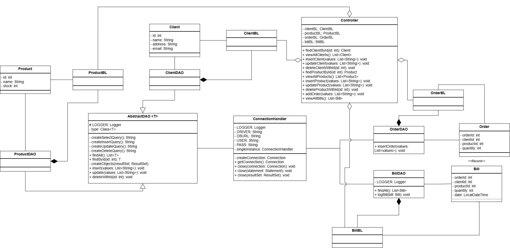
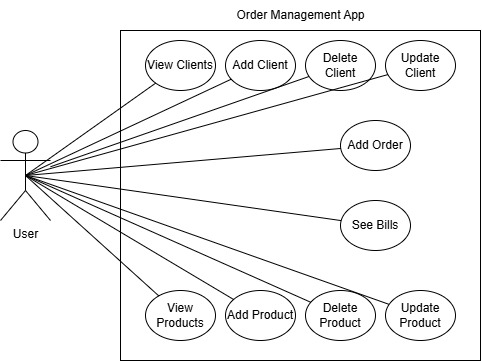
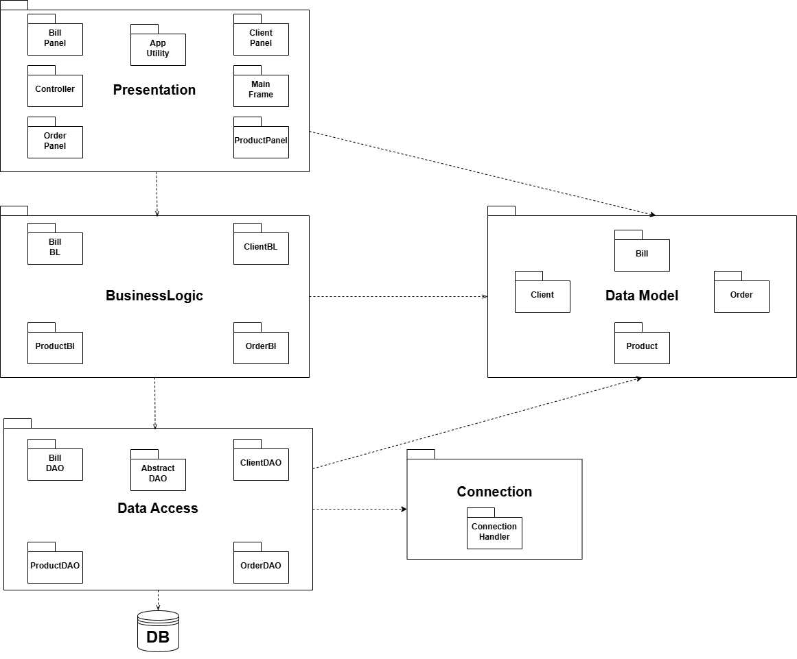

# Order Management System

A desktop order management application built with Java Swing and MySQL. Allows users to manage clients, products, and orders through a clean GUI, with automatic billing and stock management.

## Features

- Full **CRUD operations** on Clients and Products via a dynamic Swing UI
- Place orders with automatic stock validation — throws a custom `UnderStockException` if demand exceeds available stock
- Auto-generates a **Bill** (logged to the database) every time an order is placed
- View all bills in a dedicated Bills panel
- Tables are generated dynamically using **Java Reflection** — no hardcoded column names
- Generic `AbstractDAO<T>` handles all SQL queries via Reflection, keeping individual DAOs minimal

## Tech Stack

- **Language:** Java 23
- **GUI:** Java Swing
- **Build Tool:** Maven
- **Database:** MySQL
- **Connectivity:** JDBC (`mysql-connector-j`)

## Architecture

Built following a 4-layer architecture:

- `Presentation` — Swing UI panels, MainFrame, Controller
- `BussinessLogic` — Business rules, validation, custom exceptions
- `DataAccess` — Generic `AbstractDAO<T>` + specific DAOs (`ClientDAO`, `ProductDAO`, `BillDAO`, `OrderDAO`)
- `DataModels` — Entities: `Client`, `Product`, `Order`, `Bill` (record)
- `Connection` — `ConnectionHandler` Singleton for JDBC connection management

## Design Patterns Used

- **DAO Pattern** — Each entity has its own DAO extending a generic `AbstractDAO<T>`
- **Singleton Pattern** — `ConnectionHandler` ensures a single point of DB connection
- **MVC Pattern** — `Controller` decouples Presentation from BusinessLogic
- **Reflection** — Used in `AbstractDAO` to build SQL queries and map ResultSets, and in `AppUtility` to generate JTables dynamically

## Database Setup

1. Create a MySQL database named `OrderManagement`
2. Import the schema:
```bash
mysql -u root -p OrderManagement < database/schema.sql
```
3. Update the credentials in `ConnectionHandler.java`:
```java
private static final String USER = "your_username";
private static final String PASS = "your_password";
```

## Diagrams

### Class Diagram


### Use Case Diagram


### Package Diagram


## Getting Started

### Prerequisites

- Java 23+
- Maven
- MySQL 8+

### Run

```bash
git clone https://github.com/YOUR_USERNAME/order-management.git
cd order-management
mvn clean install
mvn exec:java
```

## Project Structure

```
src/
└── main/
    └── java/
        └── org/example/
            ├── BussinessLogic/   # ClientBL, ProductBL, OrderBL, BillBL, UnderStockException
            ├── Connection/       # ConnectionHandler (Singleton)
            ├── DataAccess/       # AbstractDAO, ClientDAO, ProductDAO, OrderDAO, BillDAO
            ├── DataModels/       # Client, Product, Order, Bill (record)
            ├── Presentation/     # MainFrame, panels, Controller
            └── Main.java
database/
    └── schema.sql
docs/
    ├── class-diagram.png
    ├── use-case-diagram.png
    └── package-diagram.png
```
